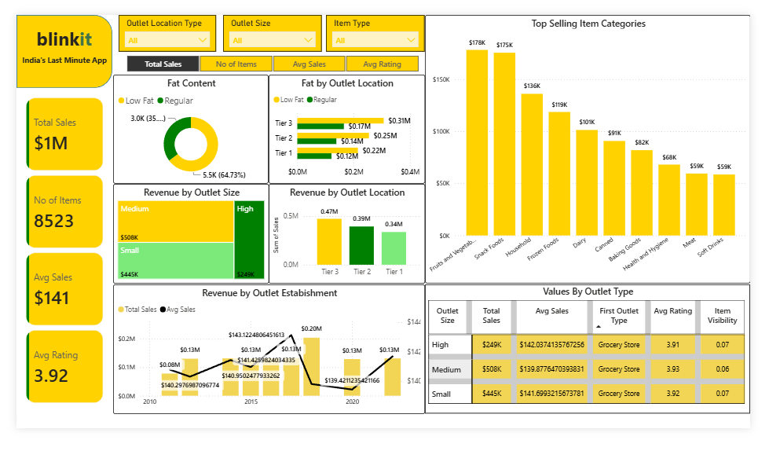

# Blinkit Sales Analysis Dashboard

## Overview

This project is an interactive Power BI dashboard built using the Blinkit grocery sales dataset. It analyzes sales performance, outlet characteristics, and product categories through interactive visualizations and KPIs.

## Dashboard Preview

## Tools Used

- Power BI
- Power Query
- DAX
- Microsoft Excel

## Dashboard Features

- KPI Cards
- Interactive Filters
- Sales Trend Analysis
- Outlet Performance Analysis
- Product Category Analysis
- Customer Rating Analysis

## Key Insights

- Medium-sized outlets generated the highest sales.
- Tier 3 outlets recorded the highest overall sales.
- Fruits & Vegetables and Snack Foods were the top-selling categories.

## Author

Sujith Kumar S
